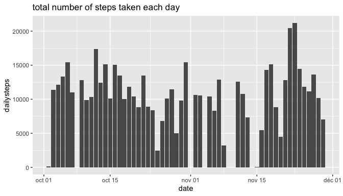
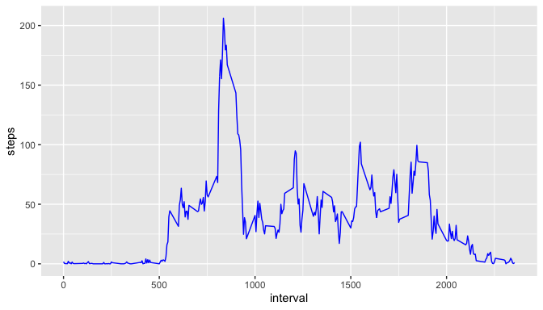
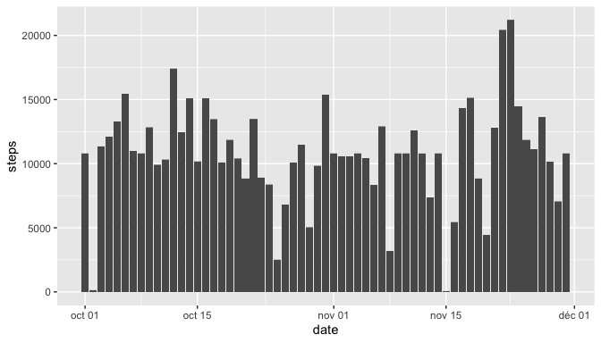
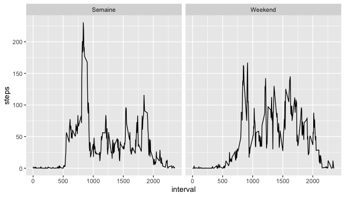

## Loading libraries

```
## ── Attaching packages ────────────────────────────────────────────────── tidyverse 1.3.0 ──
```

```
## ✓ ggplot2 3.3.0     ✓ purrr   0.3.3
## ✓ tibble  3.0.1     ✓ dplyr   0.8.5
## ✓ tidyr   1.0.2     ✓ stringr 1.4.0
## ✓ readr   1.3.1     ✓ forcats 0.5.0
```

```
## ── Conflicts ───────────────────────────────────────────────────── tidyverse_conflicts() ──
## x dplyr::filter() masks stats::filter()
## x dplyr::lag()    masks stats::lag()
```

## Loading and preprocessing the data


## What is mean total number of steps taken per day?

1. Make a histogram of the total number of steps taken each day

```r
# Calculate the total number of steps taken each day
activityday <- activity %>% 
        group_by(date) %>%
        summarise(dailysteps = sum(steps))

# Create an histogram
ggplot(activityday) + geom_col(aes(x=date,y=dailysteps)) + ggtitle("total number of steps taken each day")
```

```
## Warning: Removed 8 rows containing missing values (position_stack).
```

<!-- -->

2. Calculate and report the **mean** and **median** total number of steps taken per day


```r
mean <- mean(activityday$dailysteps,na.rm = TRUE)
median <- median(activityday$dailysteps,na.rm = TRUE)
```

The mean of total number of steps taken per day is 1.0766189\times 10^{4} & the median is 10765.


## What is the average daily activity pattern?

1. Make a time series plot (i.e. `type = "l"`) of the 5-minute interval (x-axis) and the average number of steps taken, averaged across all days (y-axis)


```r
MeanActivityPerInterval <- activity %>%
        select(interval,steps) %>%
        group_by(interval) %>%
        summarise(steps = mean(steps,na.rm = TRUE))

ggplot(MeanActivityPerInterval) + geom_line(aes(x=interval, y=steps),color="blue")
```

<!-- -->

2. Which 5-minute interval, on average across all the days in the dataset, contains the maximum number of steps?

```r
MeanActivityPerInterval2 <- activity %>%
        select(interval,steps) %>%
        group_by(interval) %>%
        summarise(steps = mean(steps,na.rm = TRUE)) %>%
        arrange(desc(steps))

interval <- slice(MeanActivityPerInterval2,1)
```

The 5-minute interval that contains the maximum number of steps is 835, 206.1698113.


## Imputing missing values

1. Calculate and report the total number of missing values in the dataset (i.e. the total number of rows with `NA`s)

```r
na <- sum(is.na(activity$steps))
```

The number of missing values in the dataset is 2304.

2. Devise a strategy for filling in all of the missing values in the dataset.
I'll use the mean activty per interval

3. Create a new dataset that is equal to the original dataset but with the missing data filled in.

```r
MeanActivityPerInterval3 <- activity %>%
        group_by(interval) %>%
        mutate(meansteps = mean(steps,na.rm = TRUE))

activitycomplete <- activity %>%
        mutate(steps = if_else(is.na(steps), MeanActivityPerInterval3$meansteps, as.double(steps)))
```

4. Make a histogram of the total number of steps taken each day and Calculate and report the **mean** and **median** total number of steps taken per day. Do these values differ from the estimates from the first part of the assignment? What is the impact of imputing missing data on the estimates of the total daily number of steps?

```r
ggplot(activitycomplete) + geom_col(aes(x=date,y=steps))
```

<!-- -->


```r
activitycompleteday <- activitycomplete %>% 
        group_by(date) %>%
        summarise(dailysteps = sum(steps))

meancomplete <- mean(activitycompleteday$dailysteps)
mediancomplete <- median(activitycompleteday$dailysteps)
```

The mean of total number of steps taken per day is 1.0766189\times 10^{4} & the median is 1.0766189\times 10^{4}.
It does not change the result much, since the NA's were ignored and have now been replaced with the mean number of steps per interval.


## Are there differences in activity patterns between weekdays and weekends?
1. Create a new factor variable in the dataset with two levels -- "weekday" and "weekend" indicating whether a given date is a weekday or weekend day.


```r
activityacompleteweekday <- activitycomplete %>%
        mutate(day = weekdays(date,abbreviate=FALSE)) %>%
        mutate(daytype = if_else(day %in% c("Dimanche", "Samedi"), "Weekend", "Semaine"))
```

2. Make a panel plot containing a time series plot (i.e. type = "l") of the 5-minute interval (x-axis) and the average number of steps taken, averaged across all weekday days or weekend days (y-axis).

```r
daytypeactivity <- activityacompleteweekday %>%
        group_by(daytype,interval) %>%
        summarise(steps = mean(steps))

ggplot(daytypeactivity) + geom_line(aes(x=interval,y=steps)) + facet_grid(~daytype)
```

<!-- -->


